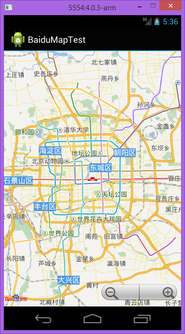

## Baidu Map Android SDK Binding

百度地图 Android SDK 的 Xamarin.Android 绑定， 目前绑定的的版本是 v2.3.1。

1. 需要自己下载百度地图 Android SDK v2.3.1， 将 jar 和 so 文件放到 AndroidBinding 项目下指定的位置， 本项目不包含 SDK 的任何文件;
2. 需要自己申请 ApiKey ， 本项目也不包括任何 ApiKey ； 
3. 百度地图 Android SDK 只提供了 armeabi 版本的 so 文件， 所以测试项目只支持 armeabi 架构；
4. 其它请参考百度地图 SDK 的文档。

